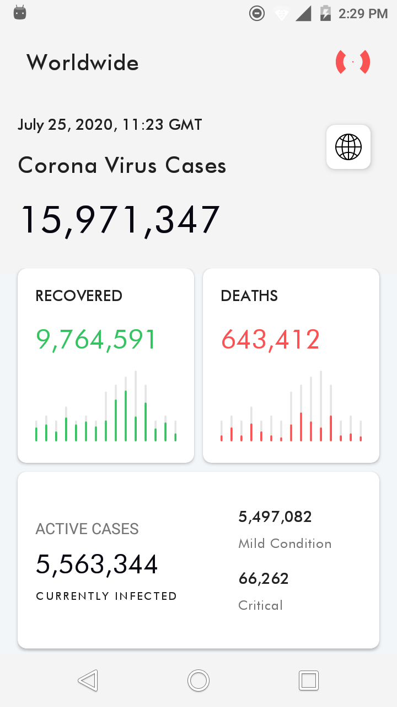
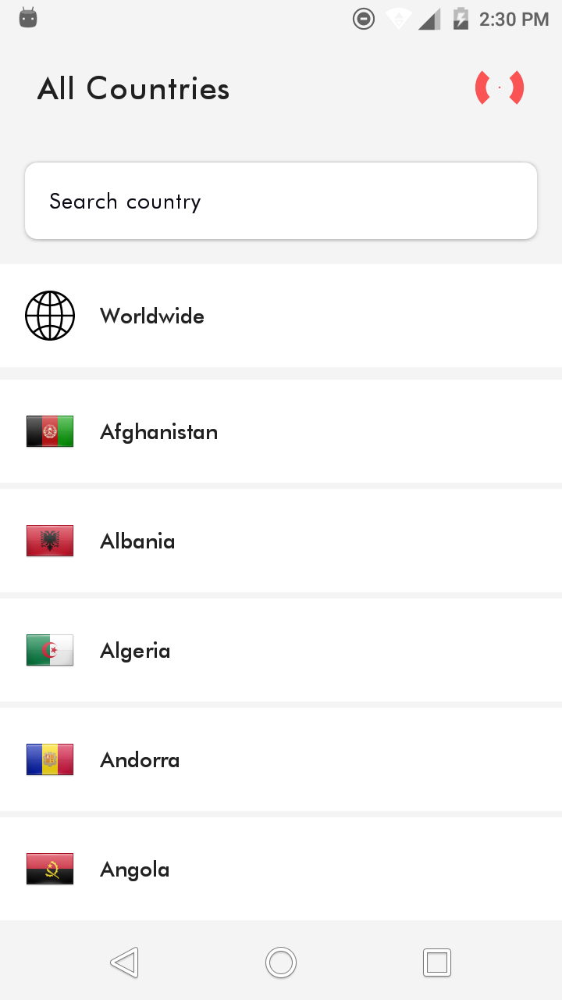
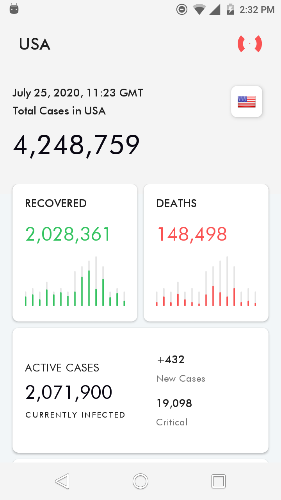

#  Covid19 Statistics App
[](https://ktlint.github.io/)
[](http://kotlinlang.org/)
[](https://lv.binarybabel.org/catalog/gradle/latest)
[](https://android-arsenal.com/api?level=22)
[](http://www.apache.org/licenses/LICENSE-2.0)

Covid19 Statistics App is built with Kotlin, Architecture components, Coroutines, Dagger2 and accessing an API built on Firebase Cloud Functions receiving Coronavirus data from [Worldometer](https://www.worldometers.info/coronavirus/).
covid-19, covid19-data,  kotlin, android,  architecture-components, dagger2-android, firebase-functions,

## Screenshots

| Worldwide Statistics                                             | All Countries List                                               | Country Statistics                                                        |
|------------------------------------------------------------------|------------------------------------------------------------------|---------------------------------------------------------------------------|
|  |  |           |

## Download Demo APK

Download and Install the Demo APK from [here](https://github.com/zakayothuku/covid19-stats-app/tree/master/app/release).

## Development

### Environment setup

First off, you require the latest Android Studio 3.5.3 (or newer) to be able to build the app.

## Architecture

The architecture of the application is based, apply and strictly complies with each of the following 5 points:

-   [Android architecture components](https://developer.android.com/topic/libraries/architecture/), part of Android Jetpack for give to project a robust design, testable and maintainable.
-   Pattern [Model-View-ViewModel](https://en.wikipedia.org/wiki/Model%E2%80%93view%E2%80%93viewmodel) (MVVM) facilitating a [separation](https://en.wikipedia.org/wiki/Separation_of_concerns) of development of the graphical user interface.

## Design

App [support different screen sizes](https://developer.android.com/training/multiscreen/screensizes) and the content has been adapted to fit for mobile devices and tablets. To do that, it has been created a flexible layout using one or more of the following concepts:

-   [Use constraintLayout](https://developer.android.com/training/multiscreen/screensizes#ConstraintLayout)
-   [Avoid hard-coded layout sizes](https://developer.android.com/training/multiscreen/screensizes#TaskUseWrapMatchPar)
-   [Create alternative layouts](https://developer.android.com/training/multiscreen/screensizes#alternative-layouts)
-   [Use the smallest width qualifier](https://developer.android.com/training/multiscreen/screensizes#TaskUseSWQuali)
-   [Use the available width qualifier](https://developer.android.com/training/multiscreen/screensizes#available-width)
-   [Add orientation qualifiers](https://developer.android.com/training/multiscreen/screensizes#TaskUseOriQuali)

In terms of design has been followed recommendations [android material design](https://developer.android.com/guide/topics/ui/look-and-feel) comprehensive guide for visual, motion, and interaction design across platforms and devices. Granting the project in this way a great user experience (UX) and user interface (UI). For more info about UX best practices visit [link](https://developer.android.com/topic/google-play-instant/best-practices/apps).

### Plugins

-   [Ktlint](https://github.com/pinterest/ktlint) - an anti-bikeshedding Kotlin linter with built-in formatter.
-   [Detekt](https://github.com/arturbosch/detekt) - a static code analysis tool for the Kotlin programming language.
-   [Spotless](https://github.com/diffplug/spotless) - a code formatter can do more than just find formatting errors.
-   [Versions](https://github.com/ben-manes/gradle-versions-plugin) - make easy to determine which dependencies have updates.
-   [SafeArgs](https://developer.android.com/guide/navigation/navigation-pass-data#Safe-args) - generates simple object and builder classes for type-safe navigation and access to any associated arguments.
-   [Jacoco](https://github.com/jacoco/jacoco) - code coverage library
-   [and more...](https://github.com/VMadalin/kotlin-sample-app/blob/master/buildSrc/build-dependencies.gradle.kts)

## Resources

### Design

UI designs from [Uplabs](https://www.uplabs.com):

-   [Covid19stats Android App](https://www.uplabs.com/posts/covid19stats-android-app) (by [Schatz Designs](https://www.uplabs.com/schatzdesigns)) - Covid19stats Android App
-   [Coronavirus Worldometer UI kit – Adobe XD](https://www.uplabs.com/posts/coronavirus-worldometer-ui-kit-adobe-xd) (by [waqart](https://www.uplabs.com/itswaqart)) - Coronavirus Worldometer UI kit – Adobe XD

### Projects

This is project draws inspiration from these awesome projects:

-   [iosched](https://github.com/google/iosched) (by [google](https://github.com/google)) - official Android application from google IO 2019.
-   [plaid](https://github.com/android/plaid) (by [android](https://github.com/android)) - app which provides design news & inspiration, being an example of implementing material design.
-   [sunflower](https://github.com/android/sunflower) (by [android](https://github.com/android)) - a gardening app illustrating Android development best practices with Android Jetpack.
-   [architecture-components-samples](https://github.com/android/architecture-components-samples) (by [android](https://github.com/android)) - collection of samples for Android Architecture Components.
-   [architecture-sample](https://github.com/android/architecture-samples) (by [android](https://github.com/android)) - collection of samples to discuss and showcase different architectural tools and patterns for Android apps.
-   [android-clean-architecture-boilerplate](https://github.com/bufferapp/android-clean-architecture-boilerplate) (by [bufferapp](https://github.com/bufferapp)) - an android boilerplate project using clean architecture
-   [android-kotlin-clean-architecture](https://github.com/sanogueralorenzo/Android-Kotlin-Clean-Architecture) (by [sanogueralorenzo](https://github.com/sanogueralorenzo)) - android sample Clean Architecture app written in Kotlin.

## Contributions

All contributions are welcome!
Please feel free to post questions, recommendations, ideas, bugs by create [new issue](https://github.com/VMadalin/kotlin-sample-app/issues/new) following the template or if you want create directly [new pull request](https://github.com/VMadalin/kotlin-sample-app/compare).

## Authors

<a href="https://github.com/zakayothuku" target="_blank">
  
  Zakayo Thuku
</a>

Follow me, I'll follow you back.

## License

```license
Copyright 2020 Zakayo Thuku

Licensed under the Apache License, Version 2.0 (the "License");
you may not use this file except in compliance with the License.
You may obtain a copy of the License at

    http://www.apache.org/licenses/LICENSE-2.0

Unless required by applicable law or agreed to in writing, software
distributed under the License is distributed on an "AS IS" BASIS,
WITHOUT WARRANTIES OR CONDITIONS OF ANY KIND, either express or implied.
See the License for the specific language governing permissions and
limitations under the License.
```
